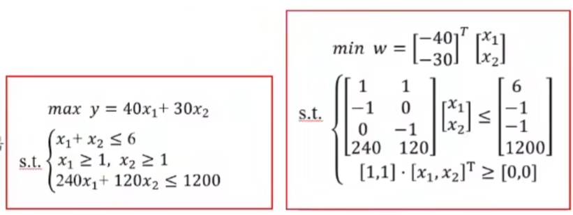

## 线性规划适用的典型赛题
>题目中提到“怎样安排/分配” “尽量多(少)” “最多(少)” “利润最大” “最合理”等词；

### 1）生产安排：原材料、设备有限制，总利润最大

- 生产两种机床，利润分别为XXX，A机器和B机器加工，两种机器工作时间...；怎样安排生产使得总利润最大？

### 2）投资收益：资产配置、收益率、损失率、组合投资、总收益最大

- 总资金为M，有n种资产可以配置，平均收益率...，风险损失率...，手续费...，设计组合投资方案使得收益尽可能大，总体风险尽可能小

### 3）销售运输：产地、销地、产量、销量、运费，总运费最省

- 商品有m个产地和n个销地，各产地的产量...，各销地需求量...由a产地运到b销地的运价xxx；如何调运才能使总运费最省？
4）
### 车辆安排：路线、起点终点、承载量、时间点、车次安排最合理 

- 不同种类的车辆有各自的承载量，工地里有多条路线，满足用工需求的情况下，如何安排车辆能使产量尽可能大？

## 代码实现
Linprog函数：1.目标函数最小值；2.约束条件小于等于或等号


```matlab
[x,fval]=linprog(f,A,b,Aeq,beq,lb,ub)
% f:目标函数的系数列向量；A,b:不等式约束条件的变量系数矩阵和常数项矩阵
% Aeq,beq:等式约束条件的系数矩阵和常数项矩阵；lb,ub:决策变量的最小取值和最大取值
f=[-40;-30];
a=[1,1;-1,0;0,-1;240,120];
b=[6;-1;-1;1200]
[x,y] = linprog(f,a,b)
y = -y % y=2
20
```
- 若不存在不等式约束，用“ [ ] ”代替A和b：[x, fval ] = linprog (f, [ ] , [ ], Aeq, beq, lb, ub)
- 若不存在等式约束，用“ [ ] ”代替Aeq和beq：[x, fval ] = linprog (f, A, b, [ ] , [ ], lb, ub)
- 没有等式约束和最小、最大取值的约束时，可以不写Aeq, beq 和lb, ub：[x, fval ] = linprog (f, A, b)
- 若题目求最大值：目标函数等号两端加符号转为求最小值；求解后目标值再取负