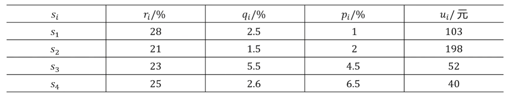

## 投资问题
### abstract
市场上有n种资产$s_i(i=1,2,...,n)$，用数额为M（本题取M=1万）的资金作为一个时期的投资
这n种资产在这一时期内购买 $s_i$ 的平均收益率为 $r_i$，风险损失率为 $q_i$
投资越分散总的风险越少，总体风险用投资的 $s_i$ 中最大的风险来度量
购买 $s_i$ 时要付交易费，费率为 $p_i$ 
当购买额不超过给定值 $u_i$ 时, 交易费按购买 $u_i$ 计算
同期银行存款利率是 $r_0=5\%$ 且无交易费无风险，n = 4时相关数据如下表：

参数定义
- $s_i(i=1,2,...,n)$：资产
- $p_i$ ：购买$s_i$的交易费率
- $u_i$：最小购买额
- $r_i$：购买 $s_i$ 的平均收益率
- $q_i$：购买 $s_i$ 的风险损失率
### problem
给该公司设计一种投资组合方案，用给定的资金M，有选择地购买若干种资产或存银行生息，使净收益尽可能大，总体风险尽可能小
### 解题
#### Basic assumptions
- 由于投资的数额M相当大，而题目设定的定额$u_i$相对于M很小，$p_i u_i$更小，因此假设每一笔交易额$x_i$都大于对应的定额$u_i$
#### 建立数学模型的核心步骤
##### 1. 设定决策变量 (Decision Variables)

首先，我们需要明确要“决定”什么。在这个问题中，我们要决定的是分配给各个资产的资金具体是多少。

- 设 $x_0$ 为存入银行的资金。
- 设 $x_i$ 为购买资产 $s_i$ 的资金（$i = 1, 2, 3, 4$）。
##### 2. 建立目标函数 (Objective Functions)

题目要求“净收益尽可能大，总体风险尽可能小”，这是一个典型的**多目标优化问题**。我们需要把这两个目标用公式表达出来。

- **目标1：净收益最大化 ($Q$)**
    投资组合的总净收益 = 银行利息 + 各项资产收益 - 各项资产交易费。
    $$\max Q = r_0 x_0 + \sum_{i=1}^{4} (r_i - p_i)x_i$$
- **目标2：总体风险最小化 ($R$)**
    题目中明确指出：“总体风险用投资的 $s_i$ 中最大的风险来度量”，且银行存款无风险。
    $$\min R = \max_{1 \le i \le 4} \{q_i x_i\}$$
##### 3. 确立约束条件 (Constraints)

资金是有限的，且投资金额不能为负数。
- **资金总额限制：** 所有的投资额加起来必须等于总资金 $M$。
    $$x_0 + x_1 + x_2 + x_3 + x_4 = M$$
- **非负限制：** 每一项投资金额都必须大于等于0。
    $$x_i \ge 0 \quad (i = 0, 1, 2, 3, 4)$$
##### 4. 核心难点：模型转化 (Model Transformation)

直接求解两个目标（既要最大又要最小）并且带有 $\max\{\}$ 函数的模型是非常困难的。因此，接下来的关键一步是将它**转化为单目标规划模型**。通常有三种思路供你选择：

###### 思路一：固定风险水平，追求最大收益（最常用、最容易求解）

我们可以设定一个投资者能够承受的**风险界限 $a$**。要求每一种资产的风险都不能超过这个界限，即 $q_i x_i \le a$（也就是 $\frac{q_i x_i}{M} \le a'$，其中 $a'$ 为风险率界限）。

此时模型变为一个标准的**线性规划问题**：
$$\max Q = r_0 x_0 + \sum_{i=1}^{4} (r_i - p_i)x_i$$
**Subject to (s.t.):**
$$\frac{q_i x_i}{M} \le a \quad (i = 1, 2, 3, 4)$$
$$\sum_{i=0}^{4} x_i = M$$
$$x_i \ge 0$$
_(做法：你可以给定不同的 $a$ 值，比如从 0.001 到 0.1，用 MATLAB 或 Python 计算出一系列最大收益 $Q$，然后画出风险-收益曲线。)_
###### 思路二：固定收益目标，追求最小风险
与思路一相反，假设公司老板要求这次投资至少要赚到利润界限 $k$，在这个前提下怎么让风险最小：
$$\min R = a$$
**s.t.**
$$r_0 x_0 + \sum_{i=1}^{4} (r_i - p_i)x_i \ge k$$
$$q_i x_i \le a$$
$$\sum_{i=0}^{4} x_i = M$$
$$x_i \ge 0$$
###### 思路三：加权折让（引入偏好系数）

引入一个权重系数 $w$ ($0 \le w \le 1$)，代表投资者对收益的偏好程度。
$$\max Z = w \cdot Q - (1-w) \cdot R$$
_(这种方法会将问题变成单目标，但因为 $R$ 还是个最大值函数，处理起来稍微麻烦一点。)_